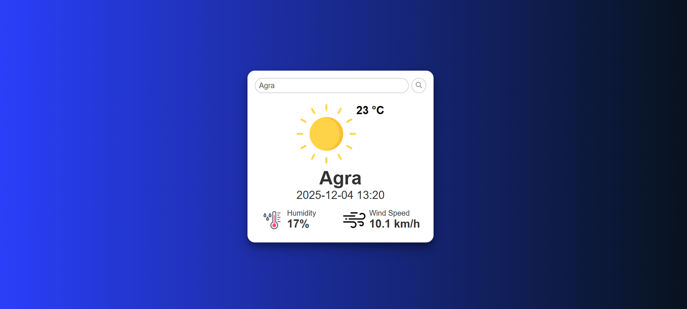

# 🌦️ Java Weather Web App (Servlet + JSP)

A clean and modern **Weather Forecasting Web Application** built using  
**Java, Servlet, JSP, HTML, CSS, JavaScript, and WeatherAPI**.

This project fetches **real-time weather data** (temperature, humidity, wind speed, condition, icons) based on the city name entered by the user.

---

## 📸 Project UI Preview

### 🔷 Live Weather Card Example  
> *Shows temperature, condition icon, humidity, wind speed & date-time*



---

## 🚀 Features

- 🌍 Search weather by city name  
- 🌡️ Shows **temperature in Celsius**
- 🌥️ Displays **weather condition with icons** (Clear, Rain, Mist, Clouds, Snow, Haze)
- 💧 Shows **humidity**
- 🌬️ Shows **wind speed**
- 🕒 Displays **real-time date & time**
- 🎨 Clean and modern UI
- 📱 Responsive design
- 🔧 Built on standard Java WebApp folder structure

---

## 🛠️ Technologies Used

| Technology | Purpose |
|-----------|----------|
| **Java** | Backend processing |
| **Servlet** | API integration logic |
| **JSP** | Dynamic UI rendering |
| **HTML5 / CSS3** | Frontend structure & styling |
| **JavaScript** | Dynamic weather icon handling |
| **WeatherAPI** | Real-time weather data |
| **Gson Library** | JSON parsing |
| **Tomcat** | Deployment & testing |
| **Eclipse IDE** | Development |

---

## 📁 Project Folder Structure

```text
weather-webapp/
│
├── src/
│   └── MyServlet.java
│
├── webapp/
│   ├── index.jsp
│   ├── index.html
│   ├── css/
│   │     └── style.css
│   ├── images/
│   │     ├── weather-logo.png
│   │     └── [your weather icons]
│   └── WEB-INF/
│         ├── web.xml
│         └── lib/
│               └── gson-2.8.5.jar
│
├── ScreenShot/
│   └── images2.png
│
├── README.md

